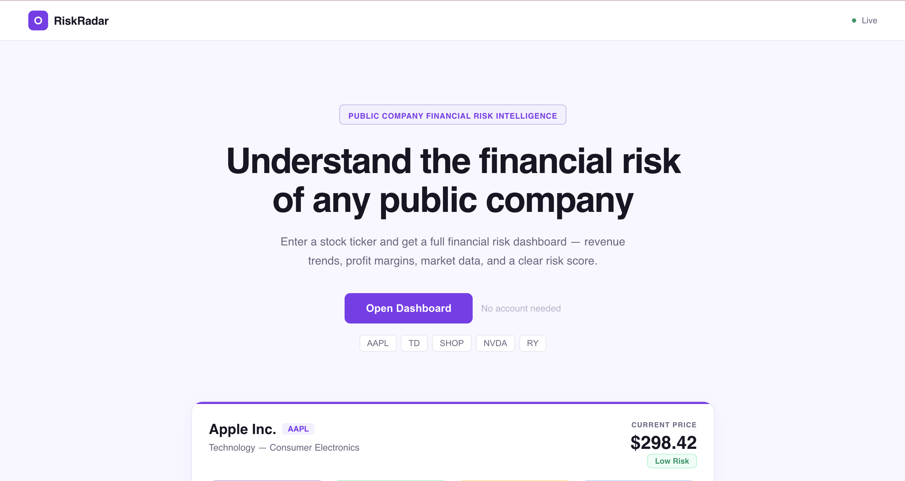
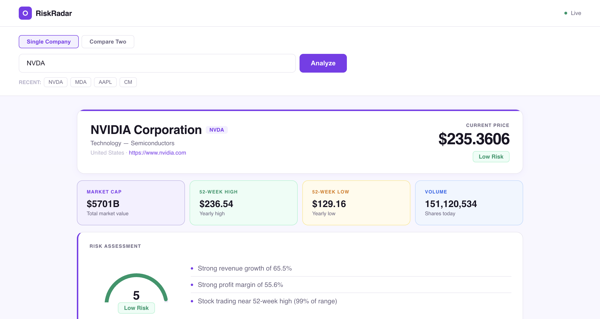
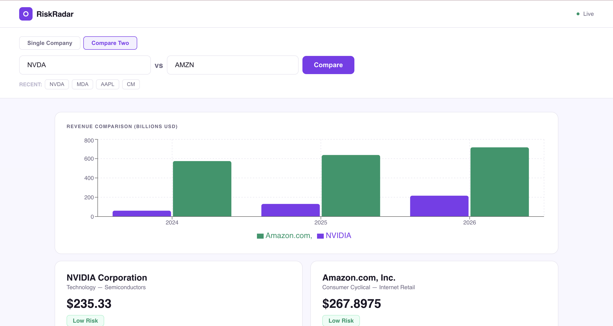

# RiskRadar - Financial Risk Intelligence Dashboard

RiskRadar is a full-stack web app I built to analyze the financial health and risk profile of any public company using real market data. You enter a stock ticker and get a full dashboard with a risk score, revenue trends, stock price history, and more.

I built this project to develop my skills in software engineering, financial data analysis, and full stack development while creating something actually useful for banking and fintech internship applications.

---

## Screenshots

### Landing Page



### Dashboard



### Company Comparison



---

## Features

- **Company Analysis** — enter any ticker (AAPL, TD, SHOP, NVDA) and get a full financial snapshot
- **Risk Scoring Engine** — custom algorithm that scores companies Low, Moderate, or Elevated Risk based on revenue growth, profit margin, and 52-week price position
- **6-Month Stock Price Chart** — real price history visualized as an area chart
- **Revenue vs Net Income Chart** — 3 years of financial trends
- **Company Comparison** — analyze two companies side by side with a bar chart revenue comparison
- **Smart Search** — autocomplete dropdown across 60+ major tickers including Canadian banks and international stocks
- **Recent Searches** — SQLite database saves every search with timestamp and risk score
- **Landing Page** — clean intro page explaining the tool before entering the dashboard

---

## Tech Stack

| Layer           | Technology       |
| --------------- | ---------------- |
| Backend         | Python, FastAPI  |
| Data            | yfinance, pandas |
| Database        | SQLite           |
| Frontend        | React            |
| Charts          | Recharts         |
| Version Control | Git, GitHub      |

---

## How It Works

1. User visits the landing page and clicks "Open Dashboard"
2. User types a ticker symbol into the search bar (with autocomplete)
3. React sends a GET request to the FastAPI backend
4. Backend fetches real financial data using yfinance
5. Risk scoring engine analyzes revenue growth, profit margin, and 52-week price position
6. Results returned as JSON and displayed on the dashboard
7. Search is saved to a SQLite database for history tracking

---

## Risk Scoring Logic

The risk engine evaluates three financial indicators and assigns a score:

**Revenue Growth** — compares the latest year's revenue to the previous year. Strong growth adds points, decline subtracts points.

**Profit Margin** — calculates net income as a percentage of revenue. Margins above 20% are strong; negative margins subtract points.

**52-Week Price Position** — determines where the current price sits relative to its yearly high and low. Near the high adds a point; near the low subtracts one.

| Score      | Label         |
| ---------- | ------------- |
| 4–5        | Low Risk      |
| 1–3        | Moderate Risk |
| 0 or below | Elevated Risk |

---

## Project Structure

riskradar/
├── backend/
│ ├── main.py # FastAPI routes
│ ├── data_fetcher.py # yfinance data fetching
│ ├── risk_scorer.py # financial risk scoring logic
│ └── database.py # SQLite operations
└── frontend/
└── src/
└── App.js # React dashboard and landing page

---

## Setup Instructions

### Prerequisites

- Python 3.9+
- Node.js 18+

### Backend

```bash
cd backend
python3 -m venv venv
source venv/bin/activate
pip install fastapi uvicorn pandas requests python-dotenv yfinance
uvicorn main:app --reload
```

### Frontend

```bash
cd frontend
npm install
npm start
```

Visit `http://localhost:3000` to use the app.

---

## What I Learned

- How to build a REST API with FastAPI and connect it to a React frontend
- How to fetch and clean real financial data from public market sources
- How to design a scoring algorithm using financial ratios and market indicators
- How React state management works with useState
- How to store and retrieve data with SQLite
- How to structure a Python project across multiple modules
- How to use Git and GitHub for version control throughout a project
- How to debug real integration issues — the original financial API I was using (FMP) deprecated their free endpoints mid-build, so I had to identify the error from the stack trace and migrate the entire data layer to yfinance with no loss of functionality

---

## Challenges

The biggest challenge was when Financial Modeling Prep deprecated their free API endpoints while I was building the data fetching layer. I had to read the error from the stack trace, diagnose the root cause, and find an alternative data source. I migrated everything to yfinance, which actually gave me more data with no API key required. It was frustrating in the moment but a good lesson in how real software development works.

---

## Future Improvements

- Add more financial metrics (debt-to-equity ratio, current ratio, PE ratio)
- Deploy live so anyone can use it without running it locally
- Add an AI-generated analyst summary for each company
- Add sector average benchmarking to compare a company against its industry
- Deduplicate the recent searches history more intelligently
- Add a downloadable PDF report

---

_Built by Jomanah Badr · McGill University · Montreal, QC_
